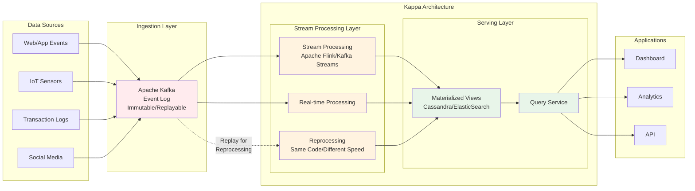

- 카프카 내부 자료구조는 FIFO 방식의 큐 자료구조와 유사
- 직렬화가 필요하다면 카프카에서 제공하는 `Serializer<T>`, `Deserializer<T>` 를 상속 받아 개발 하면 커스텀 가능
	- Producer : 큐에 데이터 적재
	- Consumer : 데이터 꺼냄
- 서비스가 비대해지고 복잡해지면 파이프라인 구축 필요
	- 데이터 추출 (extracting)
	- 변경(transforming)
	- 적재(loading)
- 카프카 장점
	- 높은 처리량 : 파티션 갯수만큼 컨슈머 갯수 늘리기 가능
	- 확장성 : 스케일아웃 쉬움
	- 영속성 : 전송받은 데이터를 파일 시스템에 적재
		- 비정상 종료에서 비교적 안전
	- 고가용성 : 일부 클러스터에 장애 발생해도 다른 클러스터에 영향 x

> [!note 카프카 클러스터 갯수]
 > 카프카 클러스터는 3대를 구성할것을 추천함.
 > - 클러스터 1 에 장애 발생 시 동기화 레이턴시로 인해 데이터 유실 가능성
 > - 유실을 막기 위해 min.insync.replicas 옵션 제공. 하지만 이 기능은 브로커 3대 이상으로 운용해야 함
 
# 1.3 데이터 레이크 아키텍처
- 람다 아키텍처
- 카파 아키텍처
## 1.3.1 람다 아키텍처
- 레거시 데이터 수집 플랫폼 개선을 위해 구성한 아키텍처 
 ```mermaid
 graph LR
      subgraph "Data Sources"
          DS1[Web/App Events]
          DS2[IoT Sensors]
          DS3[Transaction Logs]
          DS4[Social Media]
      end

      subgraph "Ingestion Layer"
          KF[Apache Kafka/Kinesis]
      end

      subgraph "Lambda Architecture"
          subgraph "Batch Layer"
              HDFS[HDFS/S3<br/>Master Dataset]
              BATCH[Batch Processing<br/>Spark/Hadoop]
              BV[Batch Views<br/>Pre-computed]
          end

          subgraph "Speed Layer"
              STREAM[Stream Processing<br/>Spark Streaming/Flink]
              RV[Real-time Views<br/>Recent Data]
          end

          subgraph "Serving Layer"
              QUERY[Query Service<br/>Druid/HBase/Cassandra]
              MERGE[View Merger]
          end
      end

      subgraph "Applications"
          APP1[Dashboard]
          APP2[Analytics]
          APP3[API]
      end

      DS1 --> KF
      DS2 --> KF
      DS3 --> KF
      DS4 --> KF

      KF --> HDFS
      KF --> STREAM

      HDFS --> BATCH
      BATCH --> BV

      STREAM --> RV

      BV --> MERGE
      RV --> MERGE

      MERGE --> QUERY
      QUERY --> APP1
      QUERY --> APP2
      QUERY --> APP3

      style HDFS fill:#e1f5fe
      style BATCH fill:#e1f5fe
      style BV fill:#e1f5fe
      style STREAM fill:#fff3e0
      style RV fill:#fff3e0
      style QUERY fill:#e8f5e9
      style MERGE fill:#e8f5e9

 ```
 
- Batch layer
	- 데이터를 모아서 특정 시간, 타이밍 마다 일괄 처리
- Serving layer
	- 가공된 데이터를 사용자, 서비스 애플리케이션이 사용할 수 있도록 데이터가 저장된 공간
- Speed layer
	- 서비스에서 생성되는 원천 데이터를 실시간으로 분석
	- 분석이 필요한 경우 이 레이어에서 수행
	- 카프카가 위치하는 곳

> ![note 서밍버드]
> 
> - 위 구조에서는 레이어가 2개로 나뉨. 
> - 배치 데이터와 실시간 데이터를 융합하여 처리할 때 다소 유연하지 못한 파이프라인 생성됨
> - 로직 구현체의 파편화를 해소하기 위해 1개의 로직을 추상화 하여 배치 레이어와 스피드 레이어에 적용하는 형태를 고안한 서밍버드(https://github.com/twitter/summingbird)
> - 하지만 결국 컴파일 이후엔 배치 레이어와 스피드 레이어에 각각 디버깅, 배포 해야 했기에 완전 해결 안됨

## 1.3.2 카파 아키텍처


- 배치 데이터를 어떻게 스트림 프로세스로 처리함?
	- 로그(데이터의 집합) 로 해결
- 


