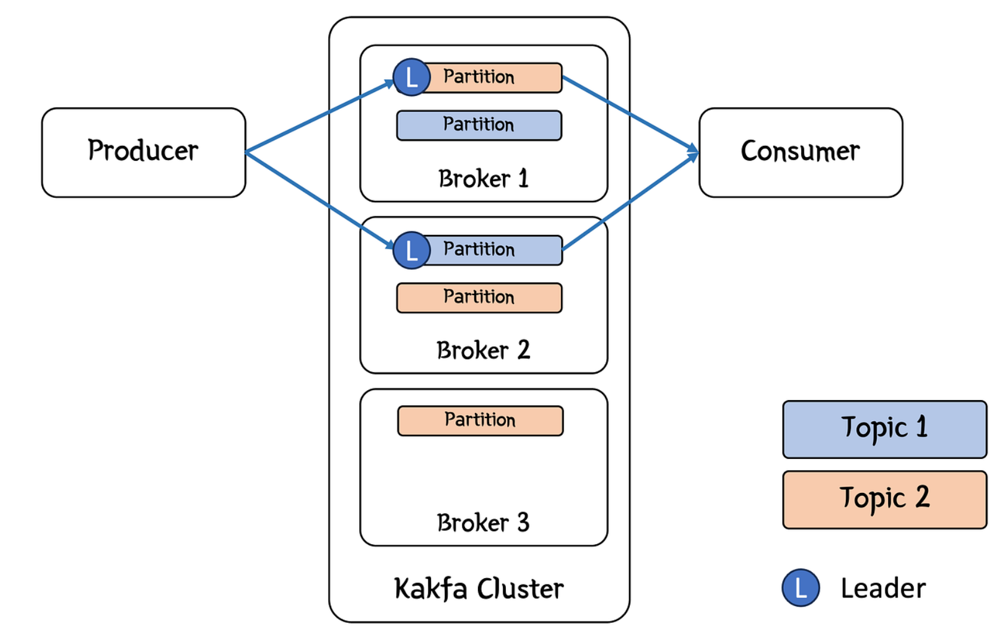
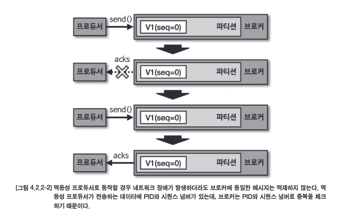
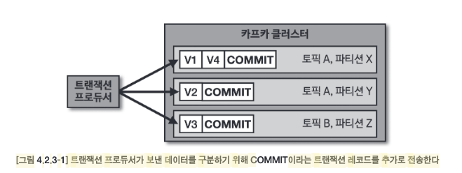
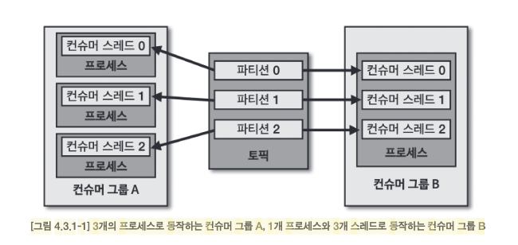

# 4장 카프카 상세 개념 설명

## 토픽, 파티션, 브로커 관계 구조

```
토픽 (Topic)
 └── 파티션 (Partition) P0
       ├── Replica (Leader)   → 브로커 1에 저장
       └── Replica (Follower) → 브로커 2에 저장

 └── 파티션 (Partition) P1
       ├── Replica (Leader)   → 브로커 2에 저장
       └── Replica (Follower) → 브로커 3에 저장
```

브로커가 완전히 토픽, 파티션을 포함하는 개념인줄 알았는데 그런건 아니고 그냥 보관소 역할이다.

- **토픽이 먼저 생김**
  - “이 토픽은 파티션을 몇 개 가질 거야, 그리고 각 파티션은 RF=2로 복제할 거야” 라고 정의함.
- **Kafka가 브로커들에 배치**
  - 그 순간부터 **토픽의 각 파티션이 여러 브로커에 분산 저장**됨.
  - 즉, “토픽 → 파티션 → 복제본 → 브로커” 순서로 매핑됨.
- **브로커는 저장소일 뿐**
  - 브로커가 파티션을 “본질적으로 포함하는 개념”은 아님.
  - 대신 “파티션의 복제본을 보관하는 집” 역할을 함.



<br>

## 4.1 토픽과 파티션

### 토픽 생성 시 파티션 개수 고려사항
- 데이터 처리량
- 메시지 키 사용 여부
- 브로커, 컨슈머 영향도

프로듀서가 보내는 데이타양과 컨슈머의 데이터 처리량을 계산해서 파티션 개수를 정하면된다.

- 프로듀서 전송 데이터량 < 컨슈머 데이터 처리량 * 파티션 개수

전체 컨슈머 데이터 처리량이 프로듀서가 보내는 데이터보다 적다면 컨슈머 랙이 생기고, 데이터 처리지연이 발생하게 된다.

### ISR(In-Sync-Replicas)

ISR은 리더 파티션과 팔로워 파티션이 모두 싱크된 상태를 뜻한다.

복제(replication-factor)개수가 2인 토픽은 리더파티션 1개와 팔로워 파티션 1개가 각각 나눠 저장된다.

- ISR로 묶인 리더 파티션과 팔로워 파티션은 파티션에 존재하는 데이터가 모두 동일하기 때문에 팔로워 파티션은 리더 파티션으로 새로 선출될 자격을 가진다.

<br>

## 4.2 카프카 프로듀서

### 4.2.1 acks 옵션

카프카 프로듀서의 acks 옵션은 0,1,all(또는 -1)값을 가질 수 있다.

#### acks=0

- 프로듀서가 메시지를 보내고 응답을 기다리지 않음
  - 가장 빠른 전송 속도
  - 데이터 손실 가능성 높음
  - 네트워크 장애 시 메시지 유실 위험

#### acks=1

- 리더 파티션에서 메시지를 받았다는 확인만 받음
  - 리더 장애 시 팔로워가 아직 복제하지 못한 데이터는 유실 가능
  - 성능과 안정성의 균형점

#### acks=all 또는 acks=-1

- 리더와 모든 팔로워 파티션에서 메시지 저장 확인
  - 가장 안전하지만 가장 느림


### 4.2.2 멱등성(Idempotence) 프로듀서

동일한 메시지를 여러 번 전송해도 한 번만 저장되는 것
- 네트워크 재시도로 인한 중복 메시지 방지

PID + 시퀀스 번호로 중복 메시지 식별 및 제거




### 4.2.3 트랜잭션(Transaction) 프로듀서

여러 파티션에 대한 원자적(atomic) 쓰기 작업, 모든 메시지가 성공하거나 모두 실패

#### 주요 설정
```shell
propertiesenable.idempotence=true
transactional.id=고유한_문자열
isolation.level=read_committed
```




- 트랜잭션 프로듀서는 트랜잭션의 시작과 끝을 표현하기 위해 트랜잭션 레코드를 한개 더 보낸다.
- 트랜잭션 컨슈머는 커밋이 완료된 데이터가 파티션에 있을 경우에만 데이터를 가져간다.


<br>

## 4.3 카프카 컨슈머



- 컨슈머 그룹 B
  - 1개의 메인 컨슈머 프로세스가 poll()로 데이터 수집
  - 수집한 레코드들을 여러 워커 스레드(컨슈머 스레드 0, 1, 2)에게 분배하여 병렬 처리
  - 컨슈머 멀티 워커 스레드 전략
- 컨슈머 그룹 A
  - 각 파티션별로 독립적인 컨슈머 스레드가 할당
  - 컨슈머 멀티 스레드 전략

두 전략의 핵심 차이점은 스레드가 어느 단계에서 분리되는지이다.

### 4.3.1 멀티 스레드 컨슈머

#### 1. 컨슈머 멀티 워커 스레드 전략

- 1개의 컨슈머 스레드가 poll()로 데이터를 가져온 후, 각 레코드별로 워커 스레드에서 병렬 처리
- 컨슈머(poll) → 워커 스레드들(병렬 처리)
- 레코드별 병렬 처리로 처리 시간이 긴 작업에 유리
- 레코드 처리 순서 보장 어려움


#### 2. 컨슈머 멀티 스레드 전략

- 각 파티션별로 독립적인 컨슈머 스레드를 운영
- 파티션 개수만큼 컨슈머 스레드 생성
- 파티션별 독립적 처리, 순서 보장


